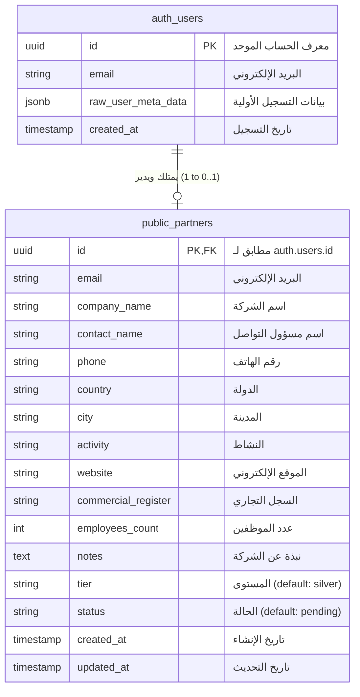
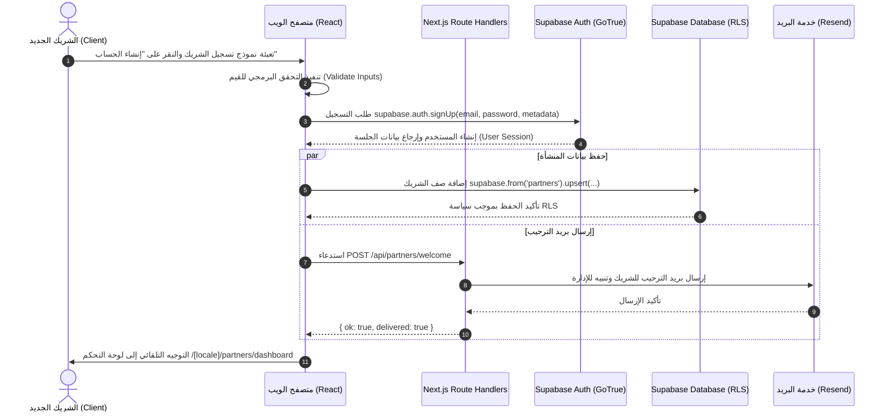
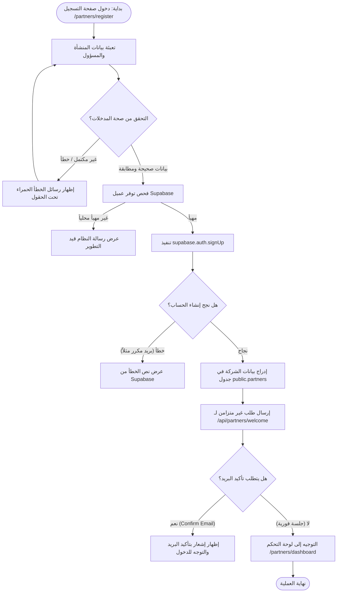
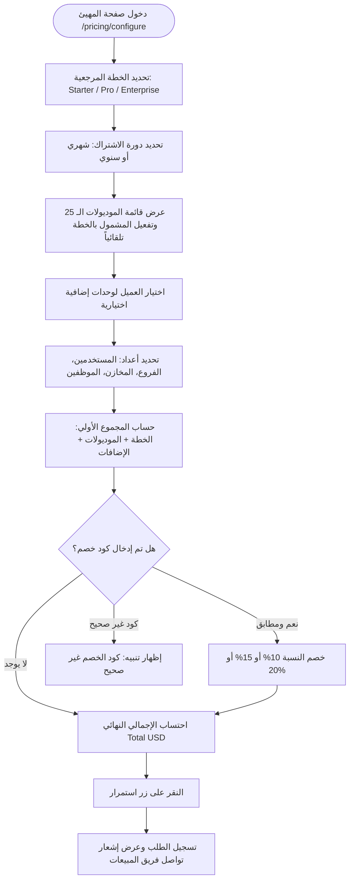

# 📋 التقرير الشامل لتحليل نظام Orminal ERP

> **تاريخ التوثيق:** 15 سبتمبر 2026  
> **الإصدار:** 1.0.0  
> **حالة النظام:** جاهز للإنتاج (Production-Ready) مع بوابة شركاء ومُهيئ أنظمة تفاعلي  
> **الموقع الرسمي المنشور:** [https://orminal-erp.vercel.app](https://orminal-erp.vercel.app)

---

## 📑 فهرس المحتويات (Table of Contents)

1. [نظرة عامة على النظام (System Overview)](#1️⃣-نظرة-عامة-على-النظام-system-overview)
   - [الوصف الوظيفي والأهداف](#الوصف-الوظيفي-والأهداف)
   - [التقنيات المستخدمة ومكدس التطوير](#التقنيات-المستخدمة-ومكدس-التطوير-tech-stack)
   - [هيكلية وبنية المجلدات](#هيكلية-وبنية-المجلدات-folder-structure)
   - [نقطة الدخول وكيفية التشغيل](#نقطة-الدخول-وكيفية-التشغيل-entry-point--running)
2. [تحليل قاعدة البيانات (Database Analysis)](#2️⃣-تحليل-قاعدة-البيانات-database-analysis)
   - [نوع ومحرك قاعدة البيانات](#نوع-ومحرك-قاعدة-البيانات)
   - [تحليل الجداول والحقول بالتفصيل](#تحليل-الجداول-والحقول-بالتفصيل)
   - [القيود والفهارس والمفاتيح](#القيود-والفهارس-والمفاتيح)
   - [الدوال المخزنة والمُشغلات (Stored Procedures & Triggers)](#الدوال-المخزنة-والمُشغلات-stored-procedures--triggers)
   - [سياسات الأمان على مستوى الصف (Row Level Security - RLS)](#سياسات-الأمان-على-مستوى-الصف-row-level-security---rls)
   - [مخطط العلاقات (ER Diagram)](#مخطط-العلاقات-er-diagram)
   - [البيانات الأولية والثابتة (Seed & Static Data)](#البيانات-الأولية-والثابتة-seed--static-data)
3. [تحليل الواجهات وتجربة المستخدم (UI/UX Analysis)](#3️⃣-تحليل-الواجهات-وتجربة-المستخدم-uiux-analysis)
   - [قائمة الصفحات والمسارات (Routes)](#قائمة-الصفحات-والمسارات-routes)
   - [تحليل تفصيلي لكل واجهة](#تحليل-تفصيلي-لكل-واجهة)
   - [النماذج والتحقق والرسائل (Forms & Alerts)](#النماذج-والتحقق-والرسائل-forms--alerts)
4. [تحليل الأزرار والإجراءات التفاعلية (Buttons & Actions)](#4️⃣-تحليل-الأزرار-والإجراءات-التفاعلية-buttons--actions)
   - [الجدول الشامل لجميع أزرار وعناصر التحكم في النظام](#الجدول-الشامل-لجميع-أزرار-وعناصر-التحكم-في-النظام)
5. [تحليل واجهات برمجة التطبيقات (APIs & Endpoints)](#5️⃣-تحليل-واجهات-برمجة-التطبيقات-apis--endpoints)
   - [نقاط نهاية الخادم (Route Handlers)](#نقاط-نهاية-الخادم-route-handlers)
   - [واجهات Supabase المدمجة المستخدمة في التطبيق](#واجهات-supabase-المدمجة-المستخدمة-في-التطبيق)
   - [مخطط تسلسل استدعاء الـ APIs (Sequence Diagram)](#مخطط-تسلسل-استدعاء-الـ-apis-sequence-diagram)
6. [تحليل منطق الأعمال وسير العمليات (Business Logic)](#6️⃣-تحليل-منطق-الأعمال-وسير-العمليات-business-logic)
   - [مخططات تدفق العمليات (Workflows & Flowcharts)](#مخططات-تدفق-العمليات-workflows--flowcharts)
   - [قواعد ومعادلات التسعير والخصومات](#قواعد-ومعادلات-التسعير-والخصومات)
   - [قواعد التحقق من صحة البيانات (Validation Rules)](#قواعد-التحقق-من-صحة-البيانات-validation-rules)
7. [نظام الصلاحيات والأمان (Auth & Security)](#7️⃣-نظام-الصلاحيات-والأمان-auth--security)
   - [آلية المصادقة وإدارة الجلسات](#آلية-المصادقة-وإدارة-الجلسات)
   - [الأدوار ومستويات الوصول (Roles & Permissions)](#الأدوار-ومستويات-الوصول-roles--permissions)
   - [طبقة الحماية في Middleware](#طبقة-الحماية-في-middleware)
   - [حماية المسارات (Protected Routes)](#حماية-المسارات-protected-routes)
8. [التبعيات والإعدادات البرمجية (Dependencies & Config)](#8️⃣-التبعيات-والإعدادات-البرمجية-dependencies--config)
   - [تحليل ملف package.json ومكتبات المشروع](#تحليل-ملف-packagejson-ومكتبات-المشروع)
   - [متغيرات البيئة (Environment Variables)](#متغيرات-البيئة-environment-variables)
   - [إعدادات الخادم والمترجم (Build & Server Config)](#إعدادات-الخادم-والمترجم-build--server-config)
9. [نقاط القوة والضعف والتوصيات الهندسية](#9️⃣-نقاط-القوة-والضعف-والتوصيات-الهندسية)
   - [نقاط القوة المعمارية والتصميمية](#نقاط-القوة-المعمارية-والتصميمية)
   - [نقاط الضعف والمخاطر التقنية المحتملة](#نقاط-الضعف-والمخاطر-التقنية-المحتملة)
   - [توصيات التطوير والتحسين (الأداء، الأمان، التوسع)](#توصيات-التطوير-والتحسين-الأداء-الأمان-التوسع)
10. [الإحصائيات النهائية للنظام (System Metrics)](#🔟-الإحصائيات-النهائية-للنظام-system-metrics)

---

## 1️⃣ نظرة عامة على النظام (System Overview)

### الوصف الوظيفي والأهداف
نظام **Orminal ERP** في مستودعه الحالي هو المنصة الرقمية والتسويقية الرسمية المتطورة لنظام إدارة وتخطيط موارد المؤسسات (ERP)، ومزود ببوابة شركاء تفاعلية مؤتمتة ومُهيئ أنظمة مالي تفاعلي (Interactive System Configurator).

النظام يدعم نمط العمل ثنائي اللغة بالكامل (**العربية RTL كأساس**، و**الإنجليزية LTR**)، مع دعم التبديل السلس بين المظهر الفاتح والداكن (Light/Dark Mode)، ونظام متكامل لتسجيل ومصادقة الشركاء وإدارة خطط الاشتراك وحساب التكاليف لحظياً.

**الأهداف التشغيلية للمشروع:**
1. **التعريف الشامل بالمنصة:** استعراض إمكانيات ووحدات Orminal ERP (المحاسبة، المخزون، المبيعات، نقاط البيع، الموارد البشرية، الأصول، التصنيع، المشاريع).
2. **برنامج الشركاء والموزعين:** إتاحة التسجيل الذاتي لشركات التقنية والخدمات المحاسبية للانضمام لشبكة شركاء Orminal، وتوفير لوحة تحكم خاصة ومحمية لمتابعة الصفقات والعمولات.
3. **حاسبة ومُهيئ الخطط التفاعلي (Configurator):** تمكين العملاء والشركاء من تخصيص الوحدات البرمجية بدقة وحساب تكاليف المستخدمين والفروع والمخازن وتطبيق قسائم الخصم الترويجية بصورة فورية.
4. **استقبال طلبات التجربة المجانية والتواصل:** أتمتة استقبال استفسارات العملاء المحتملين وتوجيه إشعارات فورية إلى البريد الإلكتروني عبر خدمة Resend.

---

### التقنيات المستخدمة ومكدس التطوير (Tech Stack)

| الطبقة (Layer) | التقنية / المكتبة | الإصدار | الوظيفة والدور في النظام |
|---|---|---|---|
| **Framework** | Next.js (App Router) | `^15.5.23` | إطار عمل React المتكامل، يدعم التوليد الهجين (SSG/SSR) والتوجيه الدولي `[locale]`. |
| **Core Runtime** | React / React DOM | `^19.2.8` | مكتبة واجهات المستخدم الأساسية مع دعم أحدث ميزات React Server Components و Hooks. |
| **Language** | TypeScript | `^6.0.3` | كتابة كود موثوق مع التحقق الصارم من الأنواع لكافة النماذج والبيانات. |
| **Styling** | Tailwind CSS | `^3.4.19` | تنسيق مرن وسريع عبر utility classes مع لوحة ألوان مخصصة ومتغيرات CSS للثيم. |
| **Animations** | Framer Motion | `^13.1.0` | حركات دقيقة، تأثيرات الظهور عند التمرير (Reveal)، وعناصر تفاعلية سلسة تحترم إعدادات تقليل الحركة. |
| **Theming** | next-themes | `^0.4.6` | إدارة التبديل بين الثيم الفاتح والداكن وتجنب وميض التحميل (FOUC). |
| **Icons** | Lucide React | `^1.31.0` | حزمة أيقونات فيكتور خفيفة ومتناسقة مع واجهات الأعمال. |
| **Database & Auth** | Supabase (PostgreSQL + GoTrue) | `@supabase/supabase-js: ^2.112.3`<br>`@supabase/ssr: ^0.12.4` | إدارة المصادقة والجلسات عبر ملفات تعريف الارتباط، وقاعدة بيانات سحابية مع سياسات RLS. |
| **Email Service** | Resend | `^6.20.0` | إرسال رسائل الترحيب بالشركاء وتنبيهات نماذج الاتصال وطلبات التجربة. |
| **CSS Preprocessing** | PostCSS + Autoprefixer | `postcss: ^8.5.26`<br>`autoprefixer: ^10.5.4` | معالجة ملفات الأنماط وضمان التوافقية مع كافة المتصفحات الحديثة. |

---

### هيكلية وبنية المجلدات (Folder Structure)

```
orminalerp/
├── .env.example                     # نموذج متغيرات البيئة السرية والعامة
├── .gitignore                       # استثناءات مستودع Git
├── README.md                        # التوثيق التقني والتشغيلي للمشروع
├── next.config.mjs                  # إعدادات مترجم Next.js والتحويلات وإعادة التوجيه
├── package.json                     # تعريف التبعيات والحزم والسكربتات
├── pnpm-lock.yaml                   # قفل نسخ التبعيات لمدير الحزم pnpm
├── postcss.config.mjs               # إعداد معالج PostCSS مع Tailwind
├── tailwind.config.ts               # تكوين ألوان وهوية Orminal ERP والخطوط والأنيميشن
├── tsconfig.json                    # إعدادات المترجم TypeScript ومسارات الاختصار (@/*)
├── public/                          # الملفات الثابتة والوسائط العامة
│   ├── logo.png                     # شعار Orminal ERP الرسمي عالي الدقة
│   └── og.svg                       # صورة بطاقة المشاركة لمنصات التواصل (OpenGraph)
├── supabase/
│   └── schema.sql                   # مخطط قاعدة البيانات (جدول partners، الفهارس، الدوال، RLS)
└── src/
    ├── middleware.ts                # برمجية وسيطة لفحص اللغة وتوجيه المسارات وتحديث جلسات Supabase
    ├── app/                         # توجيه تطبيق Next.js App Router
    │   ├── globals.css              # الأنماط العامة ومتغيرات CSS ونظام الأزرار والكروت
    │   ├── layout.tsx               # المخطط الجذري العام الممرر (Root Layout)
    │   ├── api/                     # مسارات معالجة الخادم (API Route Handlers)
    │   │   ├── contact/
    │   │   │   └── route.ts         # معالج إرسال نموذج التواصل وطلب التجربة عبر Resend
    │   │   └── partners/
    │   │       └── welcome/
    │   │           └── route.ts     # معالج إرسال بريد ترحيب الشريك وتنبيه الإدارة
    │   └── [locale]/                # المسارات المعتمدة على اللغة (ar أو en)
    │       ├── layout.tsx           # المخطط الرئيسي لكل لغة (يحدد dir و lang والخطوط و Navbar/Footer)
    │       ├── page.tsx             # الصفحة الرئيسية المتكاملة (One-Page)
    │       ├── not-found.tsx        # صفحة الخطأ 404 المترجمة
    │       ├── login/
    │       │   └── page.tsx         # صفحة تسجيل الدخول العامة للمستخدمين
    │       ├── trial/
    │       │   └── page.tsx         # صفحة طلب تجربة مجانية لمدة 14 يوماً
    │       ├── terms/
    │       │   └── page.tsx         # صفحة الشروط والأحكام القانونية
    │       ├── pricing/
    │       │   └── configure/
    │       │       └── page.tsx     # صفحة مهيئ وحاسبة تكاليف الأنظمة التفاعلية
    │       └── partners/
    │           ├── login/
    │           │   └── page.tsx     # صفحة تسجيل دخول الشركاء
    │           ├── register/
    │           │   └── page.tsx     # صفحة تسجيل حساب شريك جديد
    │           └── dashboard/
    │               └── page.tsx     # لوحة الشريك المحمية (بيانات الشريك، العمولات، الصفقات)
    ├── components/                  # مكونات واجهة المستخدم القابلة لإعادة الاستخدام
    │   ├── Configurator.tsx         # محرك تهيئة الأنظمة وحساب الأسعار التفاعلي
    │   ├── Footer.tsx               # تذييل الصفحة وروابط التواصل والنشرة البريدية
    │   ├── Icon.tsx                 # محول ديناميكي للأيقونات مسجل لـ Lucide
    │   ├── LocaleSwitch.tsx         # قائمة تبديل اللغة (عربي/إنجليزي) مع تخزين الكوكيز
    │   ├── Logo.tsx                 # مكون شعار وهوية النظام بنمطين (عادي وعكسي)
    │   ├── Navbar.tsx               # شريط التنقل العلوي المستجيب مع القائمة البرمجية للموبايل
    │   ├── NewsletterForm.tsx       # نموذج الاشتراك في النشرة البريدية
    │   ├── Providers.tsx            # مزود سمات الثيم (Next-Themes)
    │   ├── Reveal.tsx               # مكون التلاشي والحركة عند التمرير (Framer Motion)
    │   ├── ThemeToggle.tsx          # زر التبديل بين الوضع المظلم والفاتح
    │   ├── auth/                    # مكونات المصادقة وإدارة الجلسات
    │   │   ├── AuthShell.tsx        # الهيكل الموحد لواجهات الدخول والتسجيل (Split Layout)
    │   │   ├── LoginForm.tsx        # نموذج تسجيل الدخول والتحقق
    │   │   ├── PartnerRegisterForm.tsx # نموذج التسجيل الشامل للشريك مع التحقق التلقائي
    │   │   ├── SignOutButton.tsx    # زر إنهاء الجلسة وتسجيل الخروج
    │   │   └── TrialForm.tsx        # نموذج طلب التجربة المجانية
    │   └── sections/                # أقسام الصفحة الرئيسية
    │       ├── Hero.tsx             # قسم البطل والرسوم البيانية المحاكية لـ ERP
    │       ├── Features.tsx         # بطاقات الميزات والقدرات الأساسية (8 وحدات)
    │       ├── Partners.tsx         # قسم برنامج الشركاء والقطاعات المدعومة (12 قطاع)
    │       ├── Knowledge.tsx        # مركز المعرفة والدعم والبحث وتصفية المقالات
    │       ├── Pricing.tsx          # بطاقات خطط الأسعار وجدول المقارنة الشامل
    │       ├── About.tsx            # قسم نبذة عن المنصة وقيم العمل الأساسية
    │       └── Contact.tsx          # قسم التواصل المباشر ونموذج إرسال الاستفسار
    ├── content/                     # مستودعات البيانات والمحتوى المنظم ثنائي اللغة
    │   ├── features.ts              # بيانات الميزات الـ 8 وقطاعات الأعمال الـ 12
    │   ├── knowledge.ts             # مقالات مركز المعرفة والفئات وروابط الفيديو
    │   ├── modules.ts               # جميع وحدات وأنظمة ERP والإضافات وكوبونات الخصم
    │   ├── pricing.ts               # خطط الأسعار وجدول المقارنة التفصيلي لكافة الميزات
    │   └── terms.ts                 # بنود ومواد الشروط والأحكام القانونية
    ├── i18n/                        # إعدادات التدويل والترجمة
    │   ├── config.ts                # تعريف اللغات المدعومة واللغة الافتراضية ودوال الاتجاه (RTL/LTR)
    │   └── dictionaries.ts          # قواميس النصوص الكاملة باللغتين العربية والإنجليزية
    ├── lib/                         # المكتبات المساعدة والعملاء البرمجيين
    │   └── supabase/
    │       ├── client.ts            # عميل متصفح Supabase للعمليات التفاعلية في الواجهة
    │       └── server.ts            # عميل خادم Supabase المرتبط بملفات تعريف الارتباط
    └── types/                       # تعريفات TypeScript العامة
        └── assets.d.ts              # تعريف امتدادات ملفات الصور والمتجهات
```

---

### نقطة الدخول وكيفية التشغيل (Entry Point & Running)

1. **نقطة الدخول (Entry Point):**
   - عندما يطلب العميل الرابط الأساسي `/`، يقوم ملف `next.config.mjs` بتحويله فورياً إلى `/[locale]` (الافتراضي: `/ar`).
   - يتولى الملف [src/middleware.ts](file:///d:/IT-Level3-part2/projects/Orminal-ERP/orminalerp/src/middleware.ts) فحص لغة المتصفح أو كوكي `NEXT_LOCALE`، وتوجيه المستخدم، ثم تنشيط جلسة Supabase.
   - يتم تحميل الجذر في [src/app/[locale]/layout.tsx](file:///d:/IT-Level3-part2/projects/Orminal-ERP/orminalerp/src/app/%5Blocale%5D/layout.tsx) الذي يطبق الخطوط الرسمية (`IBM Plex Sans Arabic`, `Cairo`, `Inter`) وتعيين اتجاه الصفحة (`dir="rtl"` للعربية و `dir="ltr"` للإنجليزية).

2. **كيفية تشغيل النظام محلياً:**
   ```bash
   # تثبيت الحزم والتبعيات
   pnpm install
   # أو
   npm install

   # إعداد متغيرات البيئة
   cp .env.example .env.local

   # تشغيل خادم التطوير المحلي
   npm run dev
   # يتوفر الخادم عبر: http://localhost:3000

   # فحص صحة الأنواع البرمجية
   npm run typecheck

   # بناء النسخة الإنتاجية
   npm run build

   # تشغيل النسخة الإنتاجية
   npm start
   ```

---

## 2️⃣ تحليل قاعدة البيانات (Database Analysis)

### نوع ومحرك قاعدة البيانات
- **النوع:** قاعدة بيانات علائقية سحابية موثوقة تعتمد على **PostgreSQL** مقدمة عبر منصة **Supabase**.
- **محرك المصادقة:** Supabase GoTrue Auth المشفر والمبني داخل النواة.
- **مستوى الأمان:** مفعل بتقنية **Row Level Security (RLS)** مع دوال برمجية محصنة (Security Definer).

---

### تحليل الجداول والحقول بالتفصيل

#### جدول الشركاء: `public.partners`
يحمل بيانات شركات الشركاء والموزعين المسجلين في النظام، ويرتبط مباشرة بحسابات المستخدمين في جدول `auth.users`.

| اسم الحقل | نوع البيانات (Data Type) | المفتاح | القيود والقيم الافتراضية | الوصف الوظيفي |
|---|---|---|---|---|
| `id` | `uuid` | **PK, FK** | `primary key references auth.users(id) on delete cascade` | المعرف الفريد للشريك، مطابق لـ UID في نظام المصادقة |
| `email` | `text` | - | `not null` | البريد الإلكتروني الرسمي لجهة الشريك |
| `company_name` | `text` | - | `not null` | الاسم التجاري للشركة أو المؤسسة الشريكة |
| `contact_name` | `text` | - | `not null` | اسم الشخص المسؤول عن التواصل والمتابعة |
| `phone` | `text` | - | `null` | رقم الهاتف المحمول (بالمفتاح الدولي) |
| `country` | `text` | - | `null` | بلد مقر الشركة (مثلاً: اليمن، السعودية) |
| `city` | `text` | - | `null` | المدينة التابعة للبلد |
| `activity` | `text` | - | `null` | النشاط الرئيسي (توزيع برمجيات، استشارات، إلخ) |
| `website` | `text` | - | `null` | رابط الموقع الإلكتروني للشركة |
| `commercial_register` | `text` | - | `null` | رقم السجل التجاري الرسمي للمنشأة |
| `employees_count` | `integer` | - | `null` | عدد الموظفين داخل شركة الشريك |
| `notes` | `text` | - | `null` | نبذة تعريفية أو ملاحظات خاصة بالشركة |
| `tier` | `text` | - | `not null default 'silver'` | مستوى الشراكة (silver, gold, platinum) |
| `status` | `text` | - | `not null default 'pending'` | حالة الحساب (pending, active, suspended) |
| `created_at` | `timestamptz` | - | `not null default now()` | تاريخ ووقت إنشاء طلب الانضمام |
| `updated_at` | `timestamptz` | - | `not null default now()` | تاريخ ووقت آخر تحديث لبيانات الشريك |

---

### الدوال المخزنة والمُشغلات (Stored Procedures & Triggers)

1. **دالة تحديث الطابع الزمني: `public.touch_updated_at()`**
   - **النوع:** PL/pgSQL Trigger Function.
   - **الوظيفة:** تحديث الحقل `updated_at = now()` تلقائياً قبل أي تعديل على صف الشريك.
   - **المُشغل المرتبط:**
     ```sql
     create trigger partners_touch_updated_at
       before update on public.partners
       for each row execute function public.touch_updated_at();
     ```

2. **دالة مزامنة تسجيل الشريك: `public.handle_new_partner()`**
   - **النوع:** PL/pgSQL Function بامتيازات `security definer`.
   - **الوظيفة:** عند إنشاء مستخدم جديد في `auth.users`، إذا كان الميتاداتا `role == 'partner'`، تقوم الدالة بنسخ وتفريغ الحقول تلقائياً وإدراجها في جدول `public.partners` دون الحاجة لانتظار استدعاء واجهة برمجة خارجية.
   - **المُشغل المرتبط:**
     ```sql
     create trigger on_auth_user_created_partner
       after insert on auth.users
       for each row execute function public.handle_new_partner();
     ```

---

### سياسات الأمان على مستوى الصف (Row Level Security - RLS)

تم تفعيل الأمان عبر `alter table public.partners enable row level security;` مع السياسات الصارمة التالية:

1. **سياسة القراءة (`partners_select_own`):**
   - **العملية:** `FOR SELECT`
   - **الشرط:** `USING (auth.uid() = id)`
   - **النتيجة:** لا يمكن لأي شريك قراءة بيانات أي شريك آخر، يقرأ فقط الصف المرتبط بمعرفه المسجل.
2. **سياسة الإضافة (`partners_insert_own`):**
   - **العملية:** `FOR INSERT`
   - **الشرط:** `WITH CHECK (auth.uid() = id)`
   - **النتيجة:** لا يمكن إضافة صف في جدول الشركاء إلا إذا كان الـ ID يطابق هوية المستخدم الموثق.
3. **سياسة التعديل (`partners_update_own`):**
   - **العملية:** `FOR UPDATE`
   - **الشرط:** `USING (auth.uid() = id) WITH CHECK (auth.uid() = id)`
   - **النتيجة:** يستطيع الشريك تعديل بيانات ملفه الشخصي فقط دون المساس ببيانات الآخرين.

---

### مخطط العلاقات (ER Diagram)



---

### البيانات الأولية والثابتة (Seed & Static Data)

النظام يحتوي على مستودع بيانات استاتيكي فائق التنظيم لدعم العرض اللحظي والتجريبي قبل الربط الحي:
- **الخطط الأساسية (3 خطط):** `starter`, `professional`, `enterprise` بأسعار تبدأ من 20$/شهرياً حتى 800$/سنوياً.
- **الوحدات والأنظمة (25 موديول):** مقسمة على 11 قطاعاً (الأستاذ العام، البنوك، الموردين، العملاء، مراكز التكلفة، المخزون، الجرد، المشتريات، المبيعات، نقاط البيع، المطاعم، CRM، الأصول، الإنتاج، الرواتب، الحضور، الإجازات، الخدمة الذاتية، المبيعات الميدانية، تطبيق المدير، المشاريع، الجداول الزمنية).
- **الإضافات الملحقة (4 إضافات):** المستخدمين (60$/سنوي)، الفروع (60$/سنوي)، المخازن (60$/سنوي)، الموظفين (36$/سنوي).
- **كوبونات الخصم المعتمدة:**
  - `ORMINAL10`: خصم 10%
  - `PARTNER15`: خصم 15%
  - `LAUNCH20`: خصم 20%
- **المحتوى المعرفي:** 12 مقالة متخصصة مقسمة على 7 فئات فنية.
- **قطاعات الأعمال المدعومة:** 12 قطاعاً تجارياً وصناعياً وخدمياً.

---

## 3️⃣ تحليل الواجهات وتجربة المستخدم (UI/UX Analysis)

### قائمة الصفحات والمسارات (Routes)

| المسار (Route) | نوع العرض | المكون الأساسي الموجه | وصف الوظيفة |
|---|---|---|---|
| `/` | Redirect | `next.config.mjs` | إعادة التوجيه التلقائي إلى لغة العرض الأساسية `/[locale]`. |
| `/[locale]` | Server Page | [src/app/[locale]/page.tsx](file:///d:/IT-Level3-part2/projects/Orminal-ERP/orminalerp/src/app/%5Blocale%5D/page.tsx) | الصفحة الرئيسية الشاملة لجميع أقسام وميزات المنصة. |
| `/[locale]/pricing/configure` | Hybrid (SSR + Client) | [src/app/[locale]/pricing/configure/page.tsx](file:///d:/IT-Level3-part2/projects/Orminal-ERP/orminalerp/src/app/%5Blocale%5D/pricing/configure/page.tsx) | مُهيئ الأنظمة التفاعلي وحاسبة الأسعار اللحظية مع قسائم الخصم. |
| `/[locale]/trial` | Server Page + Client Form | [src/app/[locale]/trial/page.tsx](file:///d:/IT-Level3-part2/projects/Orminal-ERP/orminalerp/src/app/%5Blocale%5D/trial/page.tsx) | صفحة طلب تجربة مجانية للنظام لمدة 14 يوماً. |
| `/[locale]/login` | Server Page + Client Form | [src/app/[locale]/login/page.tsx](file:///d:/IT-Level3-part2/projects/Orminal-ERP/orminalerp/src/app/%5Blocale%5D/login/page.tsx) | واجهة تسجيل الدخول الموحدة لمستخدمي المنصة. |
| `/[locale]/partners/login` | Server Page + Client Form | [src/app/[locale]/partners/login/page.tsx](file:///d:/IT-Level3-part2/projects/Orminal-ERP/orminalerp/src/app/%5Blocale%5D/partners/login/page.tsx) | واجهة مخصصة لدخول الشركاء إلى لوحتهم الخاصة. |
| `/[locale]/partners/register` | Server Page + Client Form | [src/app/[locale]/partners/register/page.tsx](file:///d:/IT-Level3-part2/projects/Orminal-ERP/orminalerp/src/app/%5Blocale%5D/partners/register/page.tsx) | نموذج متكامل لتسجيل شركة شريك جديدة في البرنامج. |
| `/[locale]/partners/dashboard` | Dynamic Server Page | [src/app/[locale]/partners/dashboard/page.tsx](file:///d:/IT-Level3-part2/projects/Orminal-ERP/orminalerp/src/app/%5Blocale%5D/partners/dashboard/page.tsx) | لوحة القيادة الخاصة بالشريك (محمية بمصادقة الجلسة). |
| `/[locale]/terms` | Server Page | [src/app/[locale]/terms/page.tsx](file:///d:/IT-Level3-part2/projects/Orminal-ERP/orminalerp/src/app/%5Blocale%5D/terms/page.tsx) | صفحة الشروط والأحكام القانونية وسياسة الخدمة مع فهرس تنقل. |
| `/[locale]/not-found` | Client/Server | [src/app/[locale]/not-found.tsx](file:///d:/IT-Level3-part2/projects/Orminal-ERP/orminalerp/src/app/%5Blocale%5D/not-found.tsx) | صفحة الخطأ 404 المنسقة مع روابط للعودة للرئيسية. |

---

### تحليل تفصيلي لكل واجهة

#### 1. الصفحة الرئيسية (`/[locale]`)
تتكون من 7 أقسام متسلسلة تعتمد على الرسوم المتحركة والتمرير التفاعلي:
- **Hero:** شارة ترحيبية، عنوان ترويجي مع Gradient، أزرار CTA للتجربة والدخول، محاكاة بصرية حية للوحة تحكم الـ ERP بنظام CSS متجاوب، وشريط إحصاءات حية.
- **Features:** 8 بطاقات تفاعلية بأيقونات متباينة تمثل أعمدة النظام (المحاسبة، المخزون، نقاط البيع، التحليلات، CRM، الموارد البشرية، المشاريع، الأمان).
- **Partners:** استعراض مزايا الانضمام (هوامش الربح، التدريب، الدعم الفني) مع شبكة أيقونات تمثل 12 قطاعاً تجارياً تخدمه المنصة.
- **Knowledge:** شريط بحث حي وسريع مع 7 فئات لتصفية 12 مقالة، بالإضافة لمشغل فيديو سريع بدون تأخير عبر نافذة مدمجة.
- **Pricing:** تبديل دورة الدفع (شهري/سنوي مع حساب توفير 17%)، 3 بطاقات أسعار، وجدول مقارنة متقدم يغطي أكثر من 30 ميزة تفصيلية.
- **About:** شرح لرؤية المنصة وقيمها (ثنائية اللغة، سحابية وآمنة، قابلة للتوسع) مع أرقام إنجازات بصرية.
- **Contact:** نموذج اتصال فوري ومعلومات التواصل المباشرة (العنوان، الهاتف، البريد).

#### 2. صفحة مُهيئ الأنظمة (`/[locale]/pricing/configure`)
- **وصف الشاشة:** تتيح للعميل اختيار الخطة المرجعية (`Starter`, `Professional`, `Enterprise`) وتحديد دورة الفاتورة (`شهري` أو `سنوي`).
- **تخصيص الوحدات:** إمكانية تشغيل أو إيقاف أي موديول غير مدمج في الخطة من بين 25 موديولاً، وتحديث الإجمالي الرياضي لحظياً.
- **الإضافات:** عدادات رقمية مرنة لزيادة وتخفيض المستخدمين، الفروع، المخازن، والموظفين.
- **قسائم الخصم:** حقل إدخال لفحص كود التخفيض وتطبيق النسبة على المجموع الإجمالي فوراً.
- **إتمام التخصيص:** زر استمرار يعرض تأكيد استلام الطلب وتواصل المبيعات.

#### 3. صفحة لوحة الشريك (`/[locale]/partners/dashboard`)
- **حماية المسار:** يتم التحقق في الخادم من `supabase.auth.getUser()`. إذا لم يتوفر مستخدم موثق، يتم التوجيه فورياً إلى صفحة تسجيل الدخول.
- **المحتوى المعروض:**
  - رسالة ترحيبية باسم شركة الشريك.
  - 4 مؤشرات أداء رئيسية: العملاء المحتملون (Leads)، الصفقات المفتوحة (Deals)، العمولات المستحقة (Commission)، مستوى الشراكة (Tier).
  - بطاقة الملف التعريفي للشريك تحتوي على (الشركة، المسؤول، البريد، الهاتف، الدولة، المدينة، النشاط).
  - زر تسجيل الخروج الآمن وإنهاء الجلسة.

---

### النماذج والتحقق والرسائل (Forms & Alerts)

| النموذج (Form) | الحقول المطلوبة | قواعد التحقق البرمجية (Validation) | رسائل النجاح والخطأ (Alerts & Feedback) |
|---|---|---|---|
| **نموذج تسجيل الشريك**  
`PartnerRegisterForm` | - اسم الشركة  
- مسؤول التواصل  
- البريد الإلكتروني  
- رقم الهاتف  
- الدولة والمدينة  
- النشاط  
- كلمة المرور وتأكيدها  
- الموافقة على الشروط | - التحقق من عدم فراغ الحقول الأساسية.  
- البريد: صيغة بريد صحيحة عبر Regex.  
- كلمة المرور: 8 أحرف على الأقل.  
- تطابق كلمتي المرور.  
- إلزامية النقر على الموافقة على الشروط. | - `dict.auth.required` عند الفراغ.  
- `dict.auth.invalidEmail` عند خطأ الإيميل.  
- `dict.auth.weakPassword` إن قلت عن 8.  
- `dict.auth.passwordMismatch` عند عدم التطابق.  
- تنبيه أحمر عند أخطاء خادم Supabase.  
- تنبيه أخضر عند نجاح إنشاء الحساب. |
| **نموذج تسجيل الدخول**  
`LoginForm` | - البريد الإلكتروني  
- كلمة المرور | - صحة صيغة الإيميل.  
- إدخال كلمة المرور. | - تنبيه أحمر للأخطاء من Supabase (بيانات الدخول خاطئة، مستخدم غير موجود).  
- تحويل تلقائي للداشبورد فور النجاح. |
| **نموذج طلب التجربة المجانية**  
`TrialForm` | - الاسم  
- اسم الشركة  
- البريد الإلكتروني  
- رقم الجوال  
- الخطة المرغوبة  
- الرسالة (اختياري) | - التحقق من صيغة البريد والهاتف في الواجهة والخادم. | - ظهور بطاقة تأكيد خضراء: `dict.trial.success`.  
- رسالة خطأ حمراء عند تعذر الإرسال. |
| **نموذج تواصل معنا**  
`Contact` | - الاسم  
- البريد الإلكتروني  
- الجوال (اختياري)  
- الموضوع  
- الرسالة | - تحقق HTML5 القياسي (`required`, `type="email"`).  
- تحقق في الخادم بـ HTTP 422 إن كان الإيميل غير صالح. | - `dict.contact.success` باللون الأخضر.  
- `dict.contact.error` باللون الأحمر. |
| **نموذج النشرة البريدية**  
`NewsletterForm` | - البريد الإلكتروني | - فحص صيغة الإيميل عبر تعبير نمطي. | - إشعار نجاح فوري واستبدال الحقل بنص `dict.footer.subscribed`. |

---

## 4️⃣ تحليل الأزرار والإجراءات التفاعلية (Buttons & Actions)

### الجدول الشامل لجميع أزرار وعناصر التحكم في النظام

| # | الموقع / الشاشة | اسم الزر أو العنصر | الوظيفة البرمجية | الدالة / المعالج (Handler) | الطلب المستدعى (API / Action) |
|---|---|---|---|---|---|
| 1 | شريط التنقل (Navbar) | شعار Orminal ERP | الانتقال إلى الصفحة الرئيسية باللغة الحالية | Next.js Link | توجيه داخلي إلى `/[locale]` |
| 2 | شريط التنقل (Navbar) | الرئيسية (Home) | التمرير لأعلى الصفحة الرئيسية | Next.js Link | تنقل/تمرير إلى `#top` |
| 3 | شريط التنقل (Navbar) | الميزات (Features) | التمرير إلى قسم الميزات | Next.js Link | تنقل/تمرير إلى `#features` |
| 4 | شريط التنقل (Navbar) | الأسعار (Pricing) | التمرير إلى قسم الأسعار | Next.js Link | تنقل/تمرير إلى `#pricing` |
| 5 | شريط التنقل (Navbar) | المحتوى (Knowledge) | التمرير إلى قسم مركز المعرفة | Next.js Link | تنقل/تمرير إلى `#knowledge` |
| 6 | شريط التنقل (Navbar) | حولنا (About) | التمرير إلى قسم نبذة عن المنصة | Next.js Link | تنقل/تمرير إلى `#about` |
| 7 | شريط التنقل (Navbar) | الشركاء (Partners) | التمرير إلى قسم برنامج الشركاء | Next.js Link | تنقل/تمرير إلى `#partners` |
| 8 | شريط التنقل (Navbar) | زر اللغة (LocaleSwitch) | فتح القائمة المنسدلة لاختيار اللغة | `onClick={() => setOpen(!open)}` | تعديل حالة المكون داخلياً |
| 9 | شريط التنقل (Navbar) | خيار اللغة العربية | التحويل الفوري للعربية مع حفظ الكوكي | `choose('ar')` | تعيين `NEXT_LOCALE=ar` في الكوكيز وتوجيه المسار |
| 10 | شريط التنقل (Navbar) | خيار اللغة الإنجليزية | التحويل الفوري للإنجليزية مع حفظ الكوكي | `choose('en')` | تعيين `NEXT_LOCALE=en` في الكوكيز وتوجيه المسار |
| 11 | شريط التنقل (Navbar) | زر المظهر (ThemeToggle) | التبديل بين الثيم الفاتح والداكن | `setTheme(isDark ? 'light' : 'dark')` | استدعاء مكتبة `next-themes` وتحديث صنف الجذر |
| 12 | شريط التنقل (Navbar) | تسجيل الدخول (Login) | الذهاب لصفحة تسجيل الدخول العامة | Next.js Link | توجيه إلى `/[locale]/login` |
| 13 | شريط التنقل (Navbar) | جرب مجاناً (Try Free) | الذهاب لصفحة طلب التجربة المجانية | Next.js Link | توجيه إلى `/[locale]/trial` |
| 14 | شريط التنقل (موبايل) | زر فتح/إغلاق القائمة | إظهار وإخفاء القائمة المنسدلة للجوال | `onClick={() => setOpen(!open)}` | تعديل حالة `open` وعرض القائمة بـ Framer Motion |
| 15 | شريط التنقل (موبايل) | أزرار الروابط الستة | التمرير لأقسام الصفحة المختلفة في الجوال | Next.js Link مع إغلاق القائمة تلقائياً | تنقل وتمرير في الشاشة |
| 16 | قسم البطل (Hero) | جرب مجاناً (CTA Primary) | التوجه لصفحة طلب التجربة المجانية | Next.js Link | توجيه إلى `/[locale]/trial` |
| 17 | قسم البطل (Hero) | تسجيل الدخول (CTA Ghost) | التوجه لصفحة تسجيل الدخول | Next.js Link | توجيه إلى `/[locale]/login` |
| 18 | قسم البطل (Hero) | اكتشف المزيد (Scroll Down) | التمرير السلس لقسم الميزات | رابط Anchor ناعم | تمرير ناعم إلى `#features` |
| 19 | قسم الشركاء (Partners) | انضم إلينا الآن (Join Now) | فتح شاشة تسجيل حساب شريك جديد | Next.js Link | توجيه إلى `/[locale]/partners/register` |
| 20 | قسم الشركاء (Partners) | تسجيل دخول الشركاء | فتح شاشة تسجيل دخول الشركاء | Next.js Link | توجيه إلى `/[locale]/partners/login` |
| 21 | مركز المعرفة (Knowledge) | حقل البحث (Search Field) | تصفية المقالات المعروضة فورياً | `onChange={(e) => setQuery(e.target.value)}` | معالجة برمجية محلية للمصفوفة `articles` |
| 22 | مركز المعرفة (Knowledge) | زر مسح البحث (Clear 'X') | إعادة تعيين البحث وإظهار كل المقالات | `onClick={() => setQuery(''))` | تفريغ قيمة المتغير `query` |
| 23 | مركز المعرفة (Knowledge) | أزرار فئات المقالات (8 أزرار) | تصفية المقالات حسب الفئة المحددة | `onClick={() => setCategory(cat.id)}` | تعديل حالة `category` وإعادة بناء القائمة |
| 24 | مركز المعرفة (Knowledge) | زر تشغيل الفيديو (Watch Video) | استبدال واجهة الفيديو بـ Iframe اليوتيوب | `onClick={() => setPlaying(true)}` | تضمين وتشغيل مشغل يوتيوب التعليمي |
| 25 | قسم الأسعار (Pricing) | خيار الدفع الشهري | عرض الأسعار على الأساس الشهري | `onClick={() => setCycle('monthly')}` | تعديل حالة دورة الاشتراك وتحديث الكروت |
| 26 | قسم الأسعار (Pricing) | خيار الدفع السنوي | عرض الأسعار السنوية مع نسبة التوفير | `onClick={() => setCycle('annual')}` | تعديل حالة دورة الاشتراك وتحديث الكروت |
| 27 | قسم الأسعار (Pricing) | اشترِ الآن (Plan Starter) | الانتقال إلى صفحة التخصيص بخطة Starter | Next.js Link | توجيه إلى `/[locale]/pricing/configure?plan=starter` |
| 28 | قسم الأسعار (Pricing) | جرب مجاناً (Plan Starter) | التوجه لطلب تجربة مجانية | Next.js Link | توجيه إلى `/[locale]/trial` |
| 29 | قسم الأسعار (Pricing) | اشترِ الآن (Professional) | الانتقال للتخصيص بخطة Professional | Next.js Link | توجيه إلى `/[locale]/pricing/configure?plan=professional` |
| 30 | قسم الأسعار (Pricing) | جرب مجاناً (Professional) | التوجه لطلب تجربة مجانية | Next.js Link | توجيه إلى `/[locale]/trial` |
| 31 | قسم الأسعار (Pricing) | اشترِ الآن (Enterprise) | الانتقال للتخصيص بخطة Enterprise | Next.js Link | توجيه إلى `/[locale]/pricing/configure?plan=enterprise` |
| 32 | قسم الأسعار (Pricing) | جرب مجاناً (Enterprise) | التوجه لطلب تجربة مجانية | Next.js Link | توجيه إلى `/[locale]/trial` |
| 33 | مهيئ الأنظمة (Configurator) | اختيار الخطة (3 أزرار) | تبديل الخطة المعتمدة في التخصيص | `onClick={() => switchPlan(p.id)}` | تحديث السعر المرجعي وقائمة الموديولات المدمجة |
| 34 | مهيئ الأنظمة (Configurator) | دورة الاشتراك (شهري/سنوي) | تعديل مدة الاشتراك في الحسابات | `onClick={() => setCycle(c)}` | إعادة حساب جميع الوحدات والإضافات |
| 35 | مهيئ الأنظمة (Configurator) | أزرار الوحدات (25 زراً) | تفعيل أو تعطيل إضافة موديول محدد | `onClick={() => toggle(item.id)}` | إضافة/إزالة المعرف من قائمة `selected` وإعادة الجمع |
| 36 | مهيئ الأنظمة (Configurator) | إنقاص المستخدمين (-) | تقليل عدد المستخدمين الإضافيين | `setCounts(c => ({...c, users: max(1, c-1)}))` | تعديل الحسابات الرياضية للحزمة |
| 37 | مهيئ الأنظمة (Configurator) | زيادة المستخدمين (+) | زيادة عدد المستخدمين الإضافيين | `setCounts(c => ({...c, users: min(999, c+1)}))` | تعديل الحسابات الرياضية للحزمة |
| 38 | مهيئ الأنظمة (Configurator) | إنقاص الفروع (-) | تقليل عدد الفروع الإضافية | `setCounts(c => ({...c, branches: max(1, c-1)}))` | تعديل الحسابات الرياضية للحزمة |
| 39 | مهيئ الأنظمة (Configurator) | زيادة الفروع (+) | زيادة عدد الفروع الإضافية | `setCounts(c => ({...c, branches: min(999, c+1)}))` | تعديل الحسابات الرياضية للحزمة |
| 40 | مهيئ الأنظمة (Configurator) | إنقاص المخازن (-) | تقليل عدد المخازن الإضافية | `setCounts(c => ({...c, warehouses: max(1, c-1)}))` | تعديل الحسابات الرياضية للحزمة |
| 41 | مهيئ الأنظمة (Configurator) | زيادة المخازن (+) | زيادة عدد المخازن الإضافية | `setCounts(c => ({...c, warehouses: min(999, c+1)}))` | تعديل الحسابات الرياضية للحزمة |
| 42 | مهيئ الأنظمة (Configurator) | إنقاص الموظفين (-) | تقليل عدد سجلات الموظفين | `setCounts(c => ({...c, employees: max(1, c-1)}))` | تعديل الحسابات الرياضية للحزمة |
| 43 | مهيئ الأنظمة (Configurator) | زيادة الموظفين (+) | زيادة عدد سجلات الموظفين | `setCounts(c => ({...c, employees: min(999, c+1)}))` | تعديل الحسابات الرياضية للحزمة |
| 44 | مهيئ الأنظمة (Configurator) | تطبيق الخصم (Apply Code) | التحقق من كود الخصم واعتماده | `applyCode()` | فحص كائن `discountCodes` وتطبيق النسبة على `totals` |
| 45 | مهيئ الأنظمة (Configurator) | استمرار (Continue / Order) | تسجيل وإنهاء طلب التخصيص | `onClick={() => setPlaced(true)}` | إظهار رسالة إتمام الطلب وتواصل فريق المبيعات |
| 46 | مهيئ الأنظمة (Configurator) | العودة للأسعار | الرجوع إلى جدول الأسعار في الرئيسية | Next.js Link | توجيه إلى `/[locale]#pricing` |
| 47 | شاشة الدخول (LoginForm) | إظهار/إخفاء كلمة المرور | تبديل نوع حقل كلمة المرور بين text و password | `onClick={() => setShow(!show)}` | تعديل محلي في الواجهة |
| 48 | شاشة الدخول (LoginForm) | دخول (Submit Login) | التحقق من المستخدم وبدء الجلسة | `onSubmit(e)` | `supabase.auth.signInWithPassword({ email, password })` |
| 49 | شاشة الدخول (LoginForm) | أنشئ حساباً (Create One) | التوجه لصفحة إنشاء حساب شريك جديد | Next.js Link | توجيه إلى `/[locale]/partners/register` |
| 50 | شاشة الدخول (LoginForm) | نسيت كلمة المرور؟ | التوجه لقسم التواصل لطلب المساعدة | Next.js Link | توجيه إلى `/[locale]#contact` |
| 51 | تسجيل الشريك (Register) | إظهار/إخفاء كلمة المرور | تبديل نمط عرض كلمة المرور | `onClick={() => setShowPass(!showPass)}` | تعديل محلي في الواجهة |
| 52 | تسجيل الشريك (Register) | الموافقة على الشروط (Checkbox) | قبول الشروط والأحكام وسياسة الخصوصية | `onChange={(e) => set('agree', e.target.checked)}` | تعديل قيمة التحقق الإلزامية |
| 53 | تسجيل الشريك (Register) | رابط الشروط والأحكام | استعراض الشروط والاتفاقية القانونية | Next.js Link | توجيه إلى `/[locale]/terms` |
| 54 | تسجيل الشريك (Register) | إنشاء الحساب (Submit Register) | إنشاء مستخدم في Supabase وإدراجه كشريك | `onSubmit(e)` | 1. `supabase.auth.signUp(...)`<br>2. `supabase.from('partners').upsert(...)`<br>3. `fetch('/api/partners/welcome')` |
| 55 | تسجيل الشريك (Register) | سجّل الدخول (Sign in link) | التوجه لصفحة دخول الشركاء | Next.js Link | توجيه إلى `/[locale]/partners/login` |
| 56 | طلب التجربة (TrialForm) | ابدأ التجربة (Submit Trial) | إرسال بيانات طلب التجربة المجانية | `onSubmit(e)` | `fetch('/api/contact', { method: 'POST', body: ... })` |
| 57 | تواصل معنا (Contact) | إرسال (Send Message) | إرسال الاستفسار والرسالة للإدارة | `onSubmit(e)` | `fetch('/api/contact', { method: 'POST', body: ... })` |
| 58 | تواصل معنا (Contact) | رابط البريد الإلكتروني | فتح برنامج البريد لمراسلة المنصة | `href="mailto:orminalerp@gmail.com"` | بروتوكول البريد المحلي `mailto` |
| 59 | تواصل معنا (Contact) | رابط الهاتف المباشر | بدء اتصال هاتفي مباشر بفريق الدعم | `href="tel:+967737719291"` | بروتوكول الهاتف المباشر `tel` |
| 60 | لوحة الشريك (Dashboard) | تسجيل الخروج (Sign Out) | إنهاء الجلسة والرجوع للرئيسية | `onClick={...}` عبر `SignOutButton` | `supabase.auth.signOut()` وتوجيه المسار |
| 61 | لوحة الشريك (Dashboard) | العودة للرئيسية (Fallback) | الرجوع إذا كان الخادم غير مهيأ | Next.js Link | توجيه إلى `/[locale]` |
| 62 | النشرة البريدية (Newsletter) | اشترك (Submit Newsletter) | تسجيل البريد في النشرة الشهرية | `onSubmit(e)` | معالجة برمجية محلية وتأكيد الاشتراك |
| 63 | تذييل الصفحة (Footer) | أيقونة لينكد إن (LinkedIn) | فتح حساب المنصة على لينكد إن | رابط خارجي `target="_blank"` | انتقال إلى `https://www.linkedin.com/in/orminalerp` |
| 64 | تذييل الصفحة (Footer) | أيقونة منصة إكس (X / Twitter) | فتح حساب المنصة على إكس | رابط خارجي `target="_blank"` | انتقال إلى `https://x.com` |
| 65 | تذييل الصفحة (Footer) | أيقونة فيسبوك (Facebook) | فتح صفحة المنصة على فيسبوك | رابط خارجي `target="_blank"` | انتقال إلى `https://www.facebook.com` |
| 66 | تذييل الصفحة (Footer) | 8 روابط سريعة للأقسام | التنقل المباشر للميزات، الأسعار، المهيئ، الشروط | Next.js Links | تنقلات سريعة داخلية وخارجية |
| 67 | صفحة الشروط (Terms) | 8 روابط لفهرس الشروط | الانتقال السريع للمواد والبنود القانونية | روابط Anchor محلية | قفز سلس للمعرف المقابل `#section.id` |
| 68 | صفحة الشروط (Terms) | العودة للرئيسية | الرجوع إلى الصفحة الرئيسية | Next.js Link | توجيه إلى `/[locale]` |
| 69 | صفحة الخطأ 404 | الرئيسية (عربي) | الرجوع إلى الصفحة الرئيسية باللغة العربية | Next.js Link | توجيه إلى `/ar` |
| 70 | صفحة الخطأ 404 | Home (إنجليزي) | الرجوع إلى الصفحة الرئيسية باللغة الإنجليزية | Next.js Link | توجيه إلى `/en` |

---

## 5️⃣ تحليل واجهات برمجة التطبيقات (APIs & Endpoints)

### نقاط نهاية الخادم (Route Handlers)

#### 1. نقطة نهاية نماذج التواصل والتجربة: `POST /api/contact`
- **الملف المصدري:** [src/app/api/contact/route.ts](file:///d:/IT-Level3-part2/projects/Orminal-ERP/orminalerp/src/app/api/contact/route.ts)
- **الوصف:** استقبال طلبات الاتصال ورسائل العملاء المحتملين وطلبات التجربة المجانية وإرسالها عبر خدمة Resend.
- **جسم الطلب (Request Body - JSON):**
  ```json
  {
    "name": "عبدالله مريش",
    "email": "user@example.com",
    "phone": "+967737719291",
    "company": "مؤسسة الأفق",
    "plan": "professional",
    "subject": "Free trial request",
    "message": "استفسار عن الربط مع نقاط البيع",
    "locale": "ar"
  }
  ```
- **معالجة البيانات والتحقق:**
  - فحص صحة بناء الـ JSON (إرجاع `400 invalid_json` عند الخطأ).
  - فحص حقل البريد عبر تعبير نمطي والتأكد من وجود الاسم (إرجاع `422 invalid_input`).
  - تعقيم المدخلات عبر دالة `escapeHtml` للحماية من هجمات XSS في بريد الإدارة.
  - إذا لم يكن مفتاح `RESEND_API_KEY` معرفاً في البيئة، تسجل الدالة البيانات في Console السيرفر وتُرجع نجاحاً بنمط `delivered: false` لمنع تعطل تجربة المستخدم.
- **الاستجابة (Response):**
  - عند النجاح وتوفر المفتاح: `200 OK` `{"ok": true, "delivered": true}`
  - عند النجاح في وضع العرض التوضيحي: `200 OK` `{"ok": true, "delivered": false}`
  - عند خطأ خدمة البريد: `502 Bad Gateway` `{"error": "send_failed"}`

---

#### 2. نقطة نهاية الترحيب بالشريك: `POST /api/partners/welcome`
- **الملف المصدري:** [src/app/api/partners/welcome/route.ts](file:///d:/IT-Level3-part2/projects/Orminal-ERP/orminalerp/src/app/api/partners/welcome/route.ts)
- **الوصف:** إرسال رسالة ترحيب رسمية إلى الشريك فور تسجيله، وإرسال تنبيه داخلي إلى بريد إدارة Orminal ERP ببيانات الشريك الجديد.
- **جسم الطلب (Request Body - JSON):**
  ```json
  {
    "email": "partner@company.com",
    "companyName": "شركة الأنظمة الحديثة",
    "locale": "ar"
  }
  ```
- **الاستجابة (Response):**
  - نجاح: `200 OK` `{"ok": true, "delivered": true}`
  - بريد غير صحيح: `422 Unprocessable Entity` `{"error": "invalid_email"}`
  - فشل الاتصال: `502 Bad Gateway` `{"error": "send_failed"}`

---

### واجهات Supabase المدمجة المستخدمة في التطبيق

| العملية البرمجية | الدالة المستدعاة | الغرض الفني | الصلاحيات المطلوبة |
|---|---|---|---|
| **تسجيل مستخدم شريك** | `supabase.auth.signUp()` | إنشاء مستخدم موثق جديد وتخزين الميتاداتا | متاح للعامة (Anon Key) |
| **مزامنة بيانات الشريك** | `supabase.from('partners').upsert()` | تخزين بيانات الشركة في جدول الشركاء | مقيد بـ RLS (`auth.uid() = id`) |
| **تسجيل الدخول** | `supabase.auth.signInWithPassword()` | مصادقة البريد وكلمة المرور وتوليد كوكيز الجلسة | متاح للعامة (Anon Key) |
| **تسجيل الخروج** | `supabase.auth.signOut()` | إلغاء الجلسة وحذف الكوكيز المشفرة | مستخدم مسجل |
| **جلب بيانات الشريك** | `supabase.from('partners').select('*')` | عرض بيانات المنشأة في لوحة القيادة | مقيد بـ RLS (`auth.uid() = id`) |
| **التحقق من الجلسة خادمياً** | `supabase.auth.getUser()` | حماية المسارات وفحص صلاحية التوكن | خادم التطبيق (Request Cookies) |

---

### مخطط تسلسل استدعاء الـ APIs (Sequence Diagram)



---

## 6️⃣ تحليل منطق الأعمال وسير العمليات (Business Logic)

### مخططات تدفق العمليات (Workflows & Flowcharts)

#### 1. دورة تسجيل ومصادقة الشركاء (Partner Registration Flow)



---

#### 2. دورة تهيئة وحساب أسعار الأنظمة (System Configurator Logic)



---

### قواعد ومعادلات التسعير والخصومات

يتم حساب الأسعار في [src/components/Configurator.tsx](file:///d:/IT-Level3-part2/projects/Orminal-ERP/orminalerp/src/components/Configurator.tsx) و [src/content/modules.ts](file:///d:/IT-Level3-part2/projects/Orminal-ERP/orminalerp/src/content/modules.ts) وفق القواعد المالية التالية:

1. **التحويل بين الأسعار السنوية والشهرية (`unitPrice`):**
   - السعر السنوي يمثل الرقم الكامل.
   - السعر الشهري يتم اشتقاقه بقسمة السعر السنوي على 10 (مما يمنح المشتركين السنويين توفيراً بنسبة **~17%** تعادل شهرين مجاناً):
     $$\text{Monthly Price} = \frac{\text{Yearly Price}}{10}$$
2. **معادلة تكلفة الموديولات المختارة:**
   $$\text{Modules Total} = \sum (\text{unitPrice}(\text{price}, \text{cycle})) \quad \forall \, \text{Modules} \in (\text{Selected} \setminus \text{Included})$$
   *(الوحدات المدمجة ضمن الخطة الأساسية لا يُحسب لها أي سعر إضافي).*
3. **معادلة تكلفة الإضافات (المستخدمين، الفروع، المخازن، الموظفين):**
   - الوحدة الأولى مجانية مشمولة بالخطة، ويتم حساب التكلفة بدءاً من الوحدة الثانية:
     $$\text{Addons Total} = \sum (\text{unitPrice}(\text{addon.price}, \text{cycle}) \times \max(0, \text{count} - 1))$$
4. **معادلة الإجمالي النهائي مع الخصم:**
   $$\text{Subtotal} = \text{Base Plan Price} + \text{Modules Total} + \text{Addons Total}$$
   $$\text{Final Total} = \text{Subtotal} \times (1 - \text{Discount Rate})$$

---

## 7️⃣ نظام الصلاحيات والأمان (Auth & Security)

### آلية المصادقة وإدارة الجلسات
- **GoTrue Engine:** يعتمد النظام على محرك مصادقة Supabase لتوليد رموز الوصول (Access Tokens) وتحديثها (Refresh Tokens) مشفرة بمعيار **JWT**.
- **إدارة الكوكيز عبر SSR:** يستخدم النظام حزمة `@supabase/ssr` لحفظ واستخراج الجلسات من ترويسات `Request Cookies` و `Response Cookies`، مما يضمن أمانها ضد هجمات سرقة الجلسات عبر الجافاسكريبت (XSS/CSRF).

---

### الأدوار ومستويات الوصول (Roles & Permissions)

1. **الزائر العام (Guest User):**
   - استعراض الصفحة الرئيسية، ميزات النظام، الأسعار، وقراءة مقالات مركز المعرفة.
   - استخدام حاسبة ومهيئ الأنظمة التفاعلي.
   - إرسال طلب تجربة مجانية أو رسالة تواصل.
2. **الشريك الموثق (Authenticated Partner):**
   - الدخول إلى لوحة الشركاء المحمية `/[locale]/partners/dashboard`.
   - قراءة وتعديل بيانات ملف شركته بموجب سياسات RLS.
   - استعراض مؤشرات الإحالات والعمولات والصفقات الخاصة به.
3. **فريق العمل والإدارة (Admin / Team):**
   - استقبال رسائل النماذج وطلبات الانضمام عبر البريد الإلكتروني الرسمي.
   - إدارة سجلات الشركاء والتحكم بحالاتهم في لوحة Supabase.

---

### طبقة الحماية في Middleware
الملف [src/middleware.ts](file:///d:/IT-Level3-part2/projects/Orminal-ERP/orminalerp/src/middleware.ts) يؤدي مهمتين أمنيتين وتشغيليتين في غاية الأهمية:
1. **تحديث الجلسات المشفرة تلقائياً:** يقوم باستدعاء `supabase.auth.getUser()` في كل طلب لضمان تجديد الـ Session Cookies المنتهية في الخلفية.
2. **عزل المسارات المحمية:** يمنع المسارات الثابتة وطلبات الـ API من التعارض مع منطق اللغات.

---

## 8️⃣ التبعيات والإعدادات البرمجية (Dependencies & Config)

### تحليل ملف package.json ومكتبات المشروع

```json
{
  "name": "orminal-erp",
  "version": "1.0.0",
  "private": true
}
```

#### حزم الإنتاج الأساسية (`dependencies`):
- `@supabase/ssr (^0.12.4)`: حزمة مخصصة للتعامل مع Supabase في بيئات Next.js App Router عبر ملفات الكوكيز في الخادم والعميل.
- `@supabase/supabase-js (^2.112.3)`: العميل الرسمي لقاعدة بيانات ومصادقة Supabase.
- `framer-motion (^13.1.0)`: مكتبة الحركات الرسومية الاحترافية للواجهات التفاعلية.
- `lucide-react (^1.31.0)`: حزمة أيقونات متطورة وشاملة لقطاعات الأعمال.
- `next (^15.5.23)`: أحدث إصدار من إطار عمل Next.js.
- `next-themes (^0.4.6)`: مزود ثيمات الوضع المظلم والفاتح.
- `react (^19.2.8)` & `react-dom (^19.2.8)`: أحدث نواة لمكتبة React.
- `resend (^6.20.0)`: حزمة العميل الرسمية لخدمة إرسال البريد السحابي عالي الموثوقية.

#### حزم التطوير والتجميع (`devDependencies`):
- `typescript (^6.0.3)`: مترجم لغة TypeScript.
- `@types/node (^26.2.0)` & `@types/react (^19.2.18)` & `@types/react-dom (^19.2.4)`: تعريفات الأنواع الصارمة لبيئة Node و React.
- `tailwindcss (^3.4.19)`: إطار عمل التنسيق الوظيفي.
- `postcss (^8.5.26)` & `autoprefixer (^10.5.4)`: معالجة وإضافة بادئات المتصفحات لملفات CSS.

---

### متغيرات البيئة (Environment Variables)

| اسم المتغير | نوعه | إلزامي؟ | الوصف والغرض | القيمة الافتراضية / المرجعية |
|---|---|---|---|---|
| `NEXT_PUBLIC_SUPABASE_URL` | Public (Client/Server) | لحسابات الشركاء | رابط مشروع Supabase الخاص بالتطبيق | `https://xxxxxxxxxxxx.supabase.co` |
| `NEXT_PUBLIC_SUPABASE_ANON_KEY` | Public (Client/Server) | لحسابات الشركاء | المفتاح العام المجهول المسموح به في المتصفح | `eyJhbGciOi...` |
| `RESEND_API_KEY` | Secret (Server Only) | لخدمة البريد | مفتاح الوصول السحابي لخدمة Resend | `re_xxxxxxxxxxxxxxxx` |
| `CONTACT_FROM_EMAIL` | Config (Server Only) | اختياري | البريد المعتمد للمرسل (نطاق موثق) | `Orminal ERP <onboarding@resend.dev>` |
| `CONTACT_TO_EMAIL` | Config (Server Only) | اختياري | صندوق البريد المستقبل لنماذج الاستفسار والترحيب | `orminalerp@gmail.com` |
| `NEXT_PUBLIC_SITE_URL` | Public (Client/Server) | اختياري | الرابط الأساسي المنشور للتطبيق في روابط البريد والـ SEO | `https://orminal-erp.vercel.app` |

---

## 9️⃣ نقاط القوة والضعف والتوصيات الهندسية

### نقاط القوة المعمارية والتصميمية
1. **معمارية ثنائية اللغة متكاملة وذكية:** دعم حقيقي لكامل الواجهات من اتجاه اليمين لليسار (RTL) مع خطوط عربية ملائمة للأعمال (`IBM Plex Sans Arabic`, `Cairo`) والتبديل دون إعادة تحميل كاملة.
2. **الانهيار والتراجع السلس (Graceful Degradation):** تم بناء النظام بذكاء بحيث يعمل بكامل كفاءته البصرية والمعلوماتية وحساب الأسعار حتى لو لم يتم ربط مفاتيح Supabase أو Resend (حيث يُسجل النماذج في السجل ويعرض رسائل تنبيه واضحة للمستخدم دون حدوث كراش).
3. **أداء بصري فائق وخفيف (Zero Heavy Media):** واجهة محاكاة لوحة تحكم الـ ERP مبنية برمجياً بالكامل عبر Tailwind CSS و CSS Shapes، مما يوفر مئات الكيلوبايتات مقارنة بالصور الثقيلة ويسرع مؤشرات Web Vitals.
4. **أمان حقيقي على مستوى قاعدة البيانات:** عدم الاكتفاء بالتحقق في الواجهة، بل تطبيق Row Level Security (RLS) وسياسات صارمة و Triggers آلية لتوليد ومزامنة سجلات الشركاء.
5. **تجربة تخصيص استثنائية (State of the Art Configurator):** تمكين المشتركين من حساب ميزانيتهم بدقة ديناميكية مع معالجة الخصومات لحظياً.

---

### نقاط الضعف والمخاطر التقنية المحتملة
1. **بيانات لوحة تحكم الشريك تجريبية (Mocked Stats):** أرقام العمولات والصفقات (1,840 USD، 12 عميلاً محتملاً) معروضة كقيم ثابتة للعرض، وتتطلب ربطاً بجداول حقيقية للعمولات والصفقات مستقبلاً.
2. **غياب نظام التحقق الحركي من الكوبونات من قاعدة البيانات:** أكواد الخصم معرفة استاتيكياً داخل كود `src/content/modules.ts`، ويُفضل نقلها لجدول بقاعدة البيانات لإدارتها بصلاحيات وتواريخ صلاحية.
3. **عدم وجود بوابة دفع إلكتروني مدمجة:** عند الضغط على استمرار في المهيئ يظهر إشعار تواصل المبيعات، ويحتاج مستقبلاً لربط بوابة دفع كـ Stripe أو بوابة محلية معتمدة.
4. **غياب نظام استعادة كلمة المرور المباشر:** رابط "نسيت كلمة المرور؟" يوجه حالياً إلى قسم الاتصال `#contact` بدلاً من استدعاء `supabase.auth.resetPasswordForEmail`.

---

### توصيات التطوير والتحسين (الأداء، الأمان، التوسع)

#### أ. تحسينات الأمان (Security Enhancements):
- [ ] تفعيل التحقق الثنائي (2FA / MFA) لحسابات الشركاء في Supabase.
- [ ] إضافة حماية ضد السبام والهجمات الإغراقية (Rate Limiting) على مساري `/api/contact` و `/api/partners/welcome` عبر Upstash Redis أو Cloudflare Turnstile.
- [ ] تفعيل وظيفة استعادة كلمة المرور عبر البريد الإلكتروني رسمياً.

#### ب. تحسينات الأداء والتوسعية (Performance & Scalability):
- [ ] إنشاء جداول علائقية حقيقية لبرنامج الشركاء:
  - جدول `partner_leads`: لتسجيل العملاء المحتملين المحالين من كل شريك.
  - جدول `partner_commissions`: لحساب وتتبع نسب العمولات المصروفة والمعلقة.
  - جدول `discount_coupons`: لإدارة القسائم بتواريخ بدء وانتهاء وحدود استخدام.
- [ ] ربط المهيئ التفاعلي بإنشاء عروض أسعار تلقائية تصدر بصيغة PDF وترسل للشريك أو العميل مباشرة.

---

## 🔟 الإحصائيات النهائية للنظام (System Metrics)

| المقياس (Metric) | العدد المحصي فعلياً | التفاصيل والبيان |
|---|:---:|---|
| **عدد الصفحات والواجهات (Pages / Routes)** | **9** | الرئيسية، المهيئ، التجربة المجانية، الدخول العام، دخول الشركاء، تسجيل الشركاء، لوحة الشريك، الشروط، صفحة 404 (بالإضافة لإعادة التوجيه الجذري). |
| **عدد المكونات البرمجية (Components)** | **24** | 22 ملف مكونات رئيسية، تشمل 24 مكون React مستقل (بما فيها DashboardPreview و Cell و AuthShell). |
| **عدد الأزرار والإجراءات التفاعلية (Buttons & Actions)** | **70** | تم حصر وتوثيق كل زر وعنصر تحكم وإجراء تفاعلي في النظام بالكامل. |
| **عدد نقاط النهاية وواجهات الـ APIs** | **8** | 2 مسارات Route Handlers خادمية + 6 عمليات API معتمدة عبر Supabase Auth & Database SDK. |
| **عدد جداول قاعدة البيانات (Database Tables)** | **2** | جدول الشركاء `public.partners` + جدول مصادقة المستخدمين `auth.users`. |
| **عدد الموديولات والأنظمة القابلة للتخصيص** | **25** | تغطي كافة قطاعات تخطيط موارد المؤسسات مقسمة على 11 مجموعة وظيفية. |
| **عدد قطاعات الأعمال المدعومة في العرض** | **12** | تغطي البقالات، الملابس، العطور، البناء، الأثاث، المكاتب، الخدمات، التعليم، السيارات، المطاعم، الصيدليات. |
| **عدد مقالات مركز المعرفة** | **12** | موزعة على 7 فئات فنية مع نظام بحث وتصفية فوري. |
| **اللغات المدعومة** | **2** | العربية (RTL كامل مع خطوط عربية مخصصة)، والإنجليزية (LTR). |

---
> **تم إعداد هذا التقرير الفني الشامل بناءً على الفحص المصدري المباشر لملفات الكود وقواعد البيانات في النظام.**
